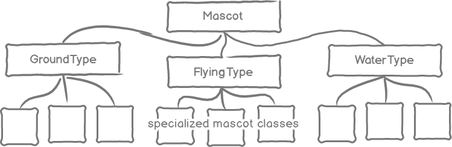

# Design Drill: Classical Inheritance 
 
## Summary 
We've begun building a new game.  We're modeling the game's characters on the Dev Bootcamp cohort mascots:  nighthawks, otters, etc.  Players will select a mascot, which they will train by battling other mascots.  Through the battles, mascots earn experience points and grow more powerful.  So, basically, it's like [Pokémon][pokemon description] for Dev Bootcamp!

*Note:* Links to relevant Pokémon information are provided, but knowledge of Pokémon gameplay is not required for completing this challenge.


### More on the Mascots
We've begun our game by focusing on the mascots themselves.  We've written classes to represent individual mascot species (e.g., `Nighthawk`).  An instance of one of our mascots has specific stats which are similar to a [Pokémon's stats][pokemon stats] (e.g., hit points, experience points, etc.) and also behaviors (e.g., its [moves][pokemon moves]).  So, basically, the mascots are like [individual Pokémon][pikachu card] for Dev Bootcamp!

The individual mascots each have a [type][pokemon types] as well.  For example, otters and sea lions are both water-type mascots, while nighthawks are flying-type mascots.  Mascots of the same type share some characteristics, like moves or resistance to certain types of attacks.


### The Pain of Change
We've only begun to design our mascots, but already we're feeling some pain.  For example, we have a formula for calculating a mascot's attack strength based on its base attack strength, its level, etc.  Any time we want to tweak the formula, we have to change it in each mascot class!  We only have six so far.  Imagine what it'll be like when we have 50.

It feels like there might be a better way of organizing our code, so we asked for a code review, and here's the feedback that we've received.

> It looks like a lot of the pain you're experiencing is the result of having knowledge repeated throughout the code base.  As you yourselves noted, tweaking the formulas for calculating attack strength, defense strength, etc. is a chore.  That's because the knowledge for how to make the calculation is residing in nine different places.  It would be easier to update and maintain the formula if you found one place for this knowledge to reside.
> 
> There are other areas where following this principle would make your code easier to maintain.  It looks like your mascots share a number of characteristics based on type.  For example, mascots of the same type share some attacks as well as resistance, susceptibility, and immunity to different attack types.  But that type-specific knowledge is repeated in multiple classes.  In how many places is the knowledge about shared attacks for water type mascots written?  Two?  Will it be repeated again if you add another water type mascot?  So, to change water-type attacks means changing every class of water-type mascot.  Also, the knowledge surrounding health, experience, leveling up, etc. is repeated throughout all the mascot classes.  Could you find one place for those bits of knowledge?
> 
> I suggest spending some time refactoring your code before moving on to adding more mascots or other features.  Take a look at [inheritance][rubylearning.com inheritance], a design pattern that can be found in almost every object-oriented programming language.  You should be able to model your mascot system with a hierarchy something like ...
> 
> 


## Releases
### Pre-release:  Get to Know the Mascots
We know that we have knowledge repeated throughout our codebase.  Let's review the code that we have (i.e., the mascot classes and their tests).  What knowledge is duplicated?  Where is it duplicated?


### Release 0: Model the System Using Inheritance
We have an opportunity to apply inheritance to our code base. Since many of our objects are of the same *type* we might use inheritance to ensure their shared behaviors are defined in one place.  We should try to implement the hierarchical structure that was suggested in the code review found in the *Summary*.  We have tests, which show that our code is working as we want it to.  As we refactor, we want to ensure that our tests continue to pass.

*Note:* We should be familiar with aspects of inheritance in Ruby (e.g., method lookup).  We'll also need to account for how inheritance affects the visibility of constants.


### Release 1: Bug-type Mascots
Now that our code is in a more maintainable state, let's continue to develop our game.  Add some bug-type mascots: dragonflies and fireflies.  Specifications for each mascot are provided in Table 1.  We'll need to write tests to demonstrate that each mascot behaves as expected.

|                       | Dragonfly    | Firefly     |
| :-------------------- | :----------- | :---------- |
| Base Hit Points       | 60           | 60          |
| Base Attack Strength  | 55           | 45          |
| Base Defense Strength | 50           | 50          |
| Resistance            | Flying       | Flying      |
| Susceptibility        | Water        | Water       |
| Immunity              | Ground       | Ground      |
| Attack 1              | Bug Bite     | Bug Bite    |
| Attack 2              | Buzz         | Buzz        |
| Attack 3              | Silver Wind  | Signal Beam |
| Attack 4              | Pin Missile  | Scissor     |

*Table 1*. Details for bug-type mascots.


### Release 2: Introduce Status and Status-changing Behaviors
We now have a nice collection of mascots, but we're noticing that their abilities aren't balanced.  We're going to try to add more balance by introducing *status*.  All mascots have a status, which defaults to `:normal`.  Some mascots will have additional behaviors that allow them to change their status.  For example, a mascot could be levitating, raging, etc. Each status would affect gameplay in some way.

These status-changing behaviors will not follow the same hierarchy with which we've been working.  In other words, within a given mascot type, not all the mascots share the same status-changing behavior.  At the same time, the same status-changing behavior can be found in mascots of different types.  To sum it up, the type of inheritance we've been using so far won't work for this situation.

We need to employ another technique for sharing behavior.  We received a tip, suggesting that we create a [module][ruby docs tuts mixin] for each of the status-changing behaviors (e.g., `Levitating`) and include it in each of the mascot classes we want to have that behavior (see Table 2).  We'll need to write tests that demonstrate (1) that all mascots initialize with a normal status, (2) that levitating/raging mascots can change their status, and (3) that a status can be returned to normal (see Figure 1).


| Mascot      | Levitating | Raging |
| :---------- | :--------: | :----: |
| Bison       |            |        |
| Bobolink    |            | X      |
| Dragonfly   |            |        |
| Firefly     |            |        |
| Nighthawk   |            | X      |
| Otter       | X          | X      |
| Sea Lion    |            |        |
| Squirrel    | X          |        |

*Table 2*. Which mascots have which status-changing behaviors.

```ruby
otter = Otter.new
# => #<Otter:0x007feed3b1f2a0 @status=:normal, @experience=0, @health=10>
otter.status
# => :normal

otter.rage
otter.status
# => :raging

otter.reset_status
otter.status
# => :normal
```
*Figure 1*.  Adjusting a mascot's status from normal to raging to normal.


## Conclusion
Whether through subclassing (e.g., mascot --> water-type --> otter) or mixing in modules, inheritance is one technique that we can use to model a system and organize our code.  Of course, when using such a technique, we need to understand how it works.  Can we explain the basics of how method look up works in Ruby?  How is it affected by one class inheriting from another class?  How is it affected by including a module in a class?


[pikachu card]: http://www.pokemon.com/us/pokemon-tcg/pokemon-cards/xy-series/xyp/XY89/
[pokemon description]: http://www.pokemon.com/us/parents-guide/
[pokemon moves]: https://en.wikipedia.org/wiki/Gameplay_of_Pok%C3%A9mon#Pok.C3.A9mon_moves
[pokemon stats]: https://en.wikipedia.org/wiki/Gameplay_of_Pok%C3%A9mon#Stats
[pokemon types]: https://en.wikipedia.org/wiki/Gameplay_of_Pok%C3%A9mon#Pok.C3.A9mon_types
[ruby docs tuts mixin]: http://ruby-doc.com/docs/ProgrammingRuby/html/tut_modules.html
[rubylearning.com inheritance]: http://rubylearning.com/satishtalim/ruby_inheritance.html


